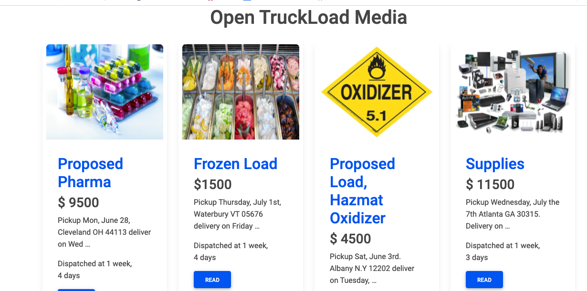
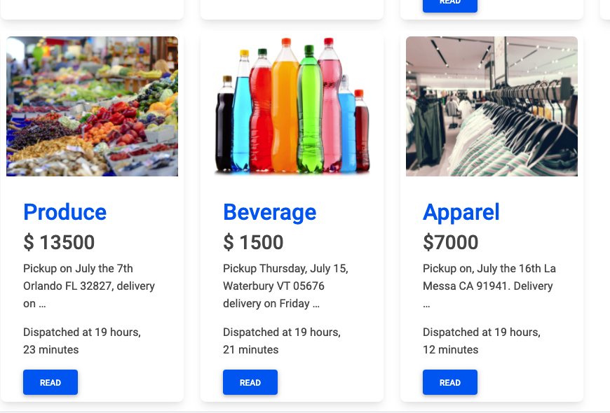
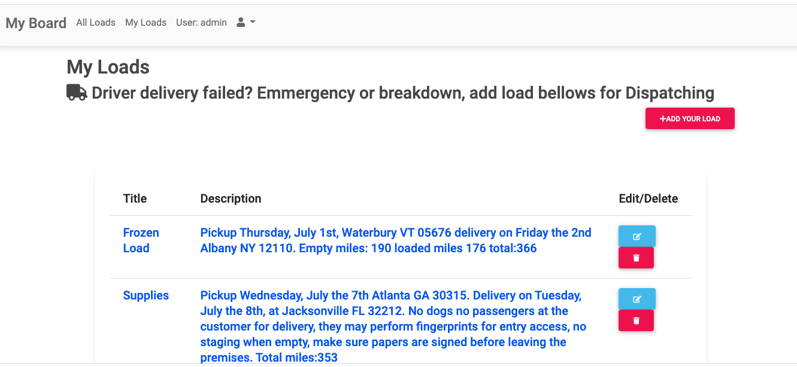
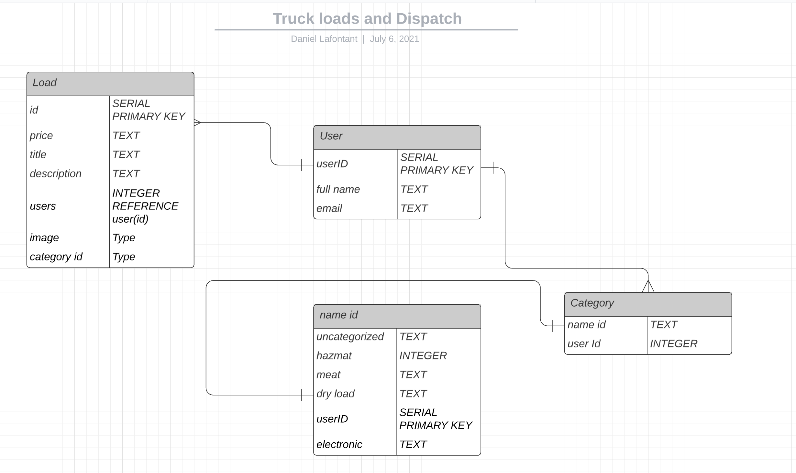
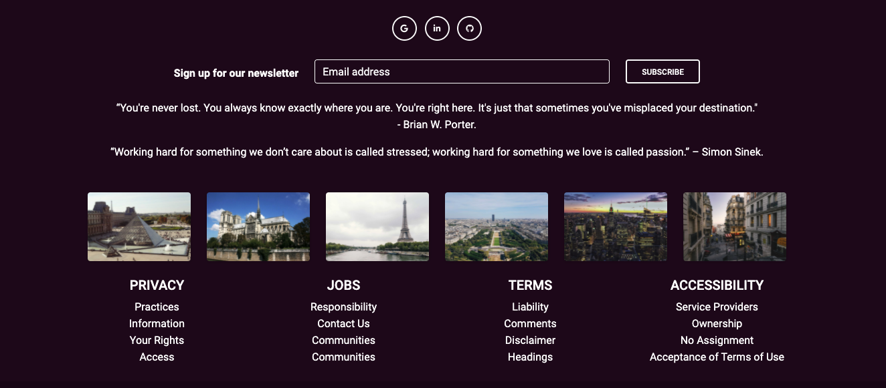

# Truckload-and-Dispatch
## Home Page
1. Fully responsive adapted to all mobile screens, all working functions, and links for a Dispatching load board.
2. The home page displays all loads where truck drivers can check availability, with the option to put their phone number for bidding and load agreement if dispatch agrees with the pricing.

3. The loads show  information such as prices and related past trips

4. Dispatch can log in or create an account to post, add,  edit and delete load when a driver is assigned.

## An embedded screenshot of the app



## Explanations of the technologies used
1. Technologies used: Python, Dango, HTML, SCSS, JacaScript Bootstrap,  Django, NGROk for local hosting, Django-extensions for scripts.
2. Ngrok for all HTTP traffic running over your tunnels local server, update loads from all users, and text messages

## Function to create static truc default the users removed all created load
````````
def run():
    for i in range(5, 15):
        load = Load()
        load.image = "http://default"
        load.tilte = "Load No #%d" % i
        load.price = "Price No #%d" % i
        load.desc = "Description load No #%d" % i
        load.save()
print("test passed")

````````
## Models created to support the apps
```````
from django.contrib import admin

from .models import Load, Category, Message, PhoneNumber

# Register your models here.
admin.site.register(Load)
admin.site.register(Category)
admin.site.register(PhoneNumber)

```````

## Loads created by used (Dispatch) have automated date-time support generated and truncates features to hide full descriptions.



## A couple paragraphs about the general approach
1. Bootstrap is used and SCSS customized to separate data rendered from the models with classes containers, cols, and rows, {block content} on the base.html to display many arguments.
2. Bootstrap file is downloaded and unzipped as static style folder: https://mdbootstrap.com/
3. Media file is created and added to the settings.py and configurated as a static file to store image or logos for a loads card: https://docs.djangoproject.com/en/3.2/howto/static-files/
4. Display users log in and log out sessions and link navigations through the app.

## Installation instructions for any dependencies
* Fork and Clone the repo
* https://truckloads.herokuapp.com/
* not secured link : http://danieljajr.pythonanywhere.com/

## Who are your users.
* Anyone can check loads on the home page
* To add loads users are described as a dispatch where they have their private dashboard (CRUD) to log-in add post edit only their private loads.


## Link to  wireframes – sketches of major views / interfaces of the application


# Responsive footer and navigation  bar for users.


## Proposed architecture
* Ngrok for all HTTP traffic running over your tunnels
* Reset passord options for users
* Enable twilio function for private users, to send sms and messages for loads. All numbers are will be stored in our database and no securty against Hacking is provided.  


